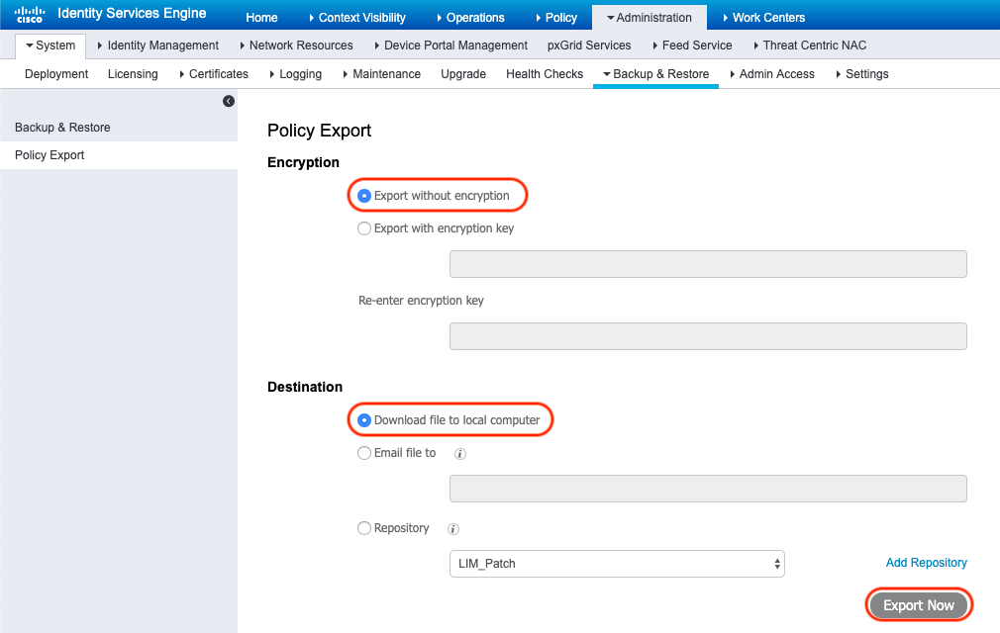
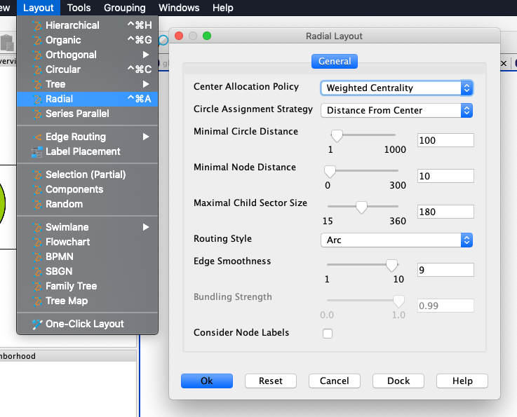
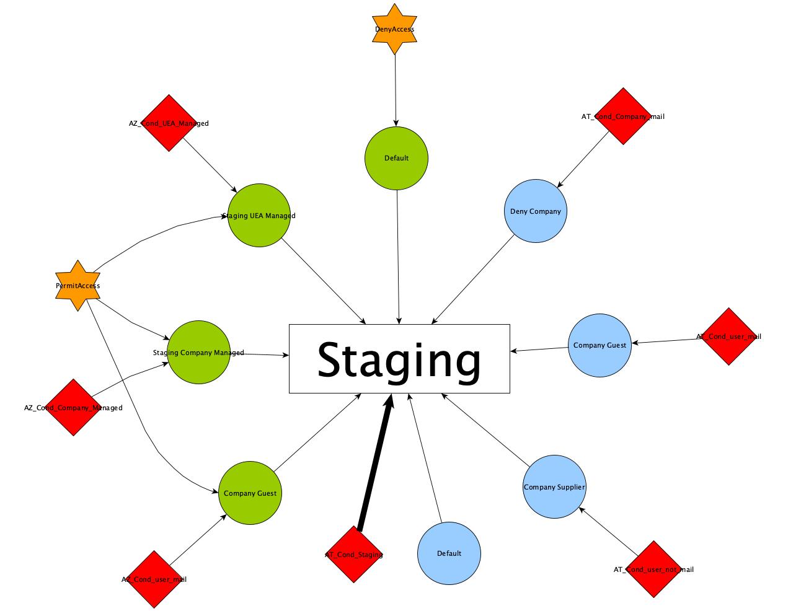
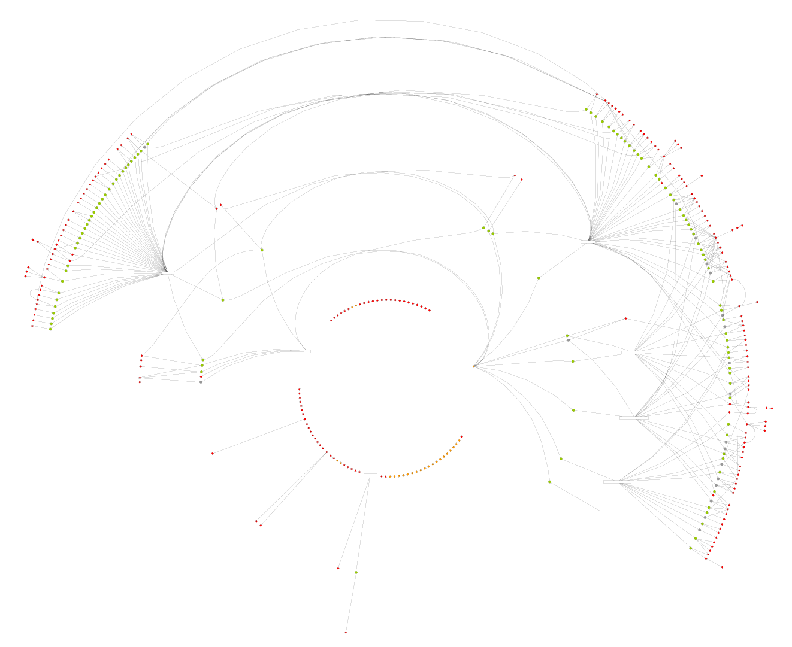
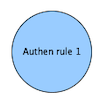
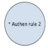
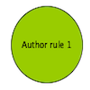
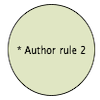
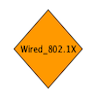

<h1 align="center">ISE Policy Grapher</h1>

A simple tool that will parse your exported ISE Policy XML file and translate it to a GraphML file that you can open with yEd (or others graphing tools) to visualize it. 

It will also help you to identify unused objects (disabled rules, unlinked conditions and authorization profiles) which can be cleaned. 

Compatible with all ISE versions >= 2.6. 

## Installation 

#### 1. Clone the repo to your working directory 
```bash
git clone https://github.com/AnthoBalitrand/ise-policy-grapher.git
```

#### 2. Create a virtual environment (optional) and activate it 
```bash
python3 -m venv ./venv
source venv/bin/activate
```

#### 3. Install requirements 
```bash
pip3 install --trusted-host pypi.org --trusted-host files.pythonhosted.org -r requirements.txt
```

## How to use it 

#### 1. Extract your ISE policy file 

Through the administration GUI, browse to Administration --> Backup & Restore --> Policy Export

Encrypted files are not supported. 



#### 2. Start the script with input file 

```bash
python3 ise_grapher.py ise_policy_file.xml 
```

#### 3. Output

Several files will be created in the "outputs" directory :

- <policy_name>.graphml for each policy of the policy set 
- global.graphml for the global view of all objects 

**<policy_name>.graphml** will display only objects used on the given policy (not orphan objects).

**global.graphml** will display all objects, including unused ones, to help for cleaning. 


## Visualization

You can open the generated files with yEd. 

For better visibility, use the "Radial" layout with default parameters : 



Here's an output example for a given policy : 



Here's an output example for the global graph (notice the unused objects that can be clearly identified) : 



## Objects types

### Policy object
 

### Active authentication rule 


### Disabled authentication rule 
(note that a * is prepended to the name)



### Active authorization rule 


### Disabled authorization rule
(note that a * is prepended to the name)



### Default condition (Cisco provided) 


### Custom condition 


### Default authorization profile (Cisco provided)


### Custom authorization profile

